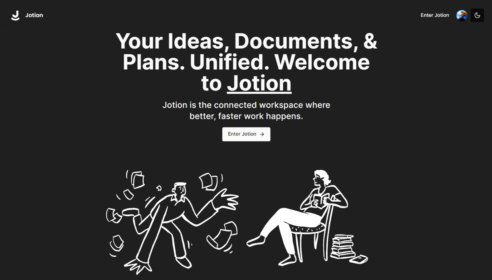

# Next.js 13, React, Convex, Tailwind



### Cloning the repository

```shell
git clone https://github.com/bintangnugrahaa/jotion.git
```

### Install packages

```shell
npm install
```

### Setup .env file


```js
# Deployment used by `npx convex dev`
CONVEX_DEPLOYMENT=            # team: bintangnugrahaa, project: jotion-9505a
NEXT_PUBLIC_CONVEX_URL=

NEXT_PUBLIC_CLERK_PUBLISHABLE_KEY=
CLERK_SECRET_KEY=

EDGE_STORE_ACCESS_KEY=
EDGE_STORE_SECRET_KEY=
```

### Setup Convex

```shell
npx convex dev

```

### Start the app

```shell
npm run dev
```
